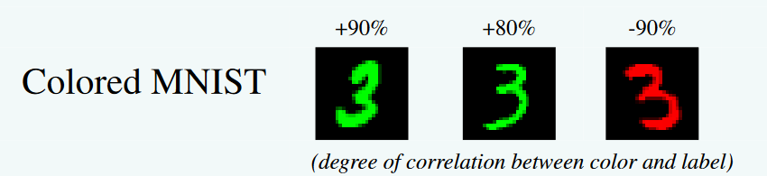
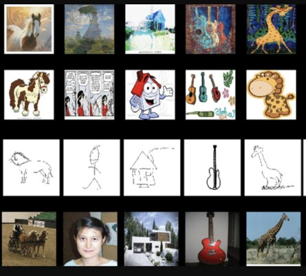
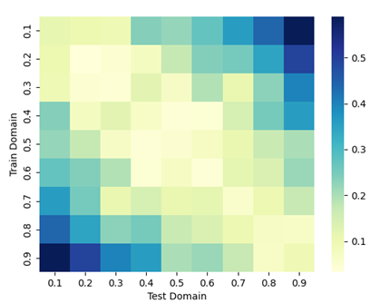
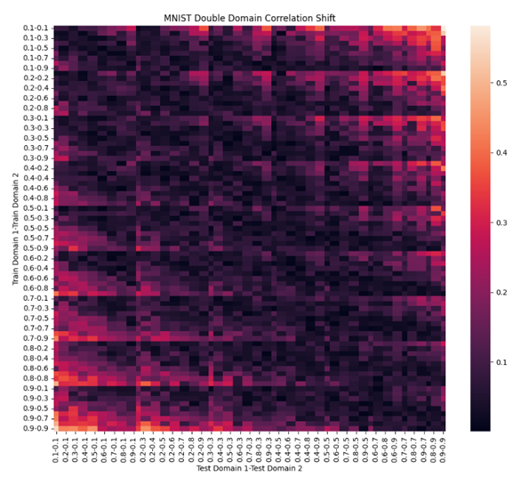
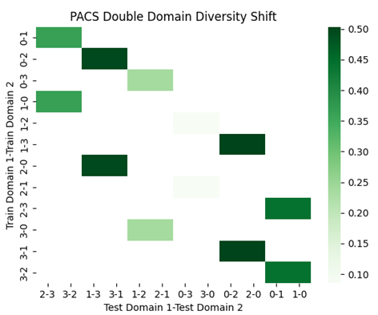
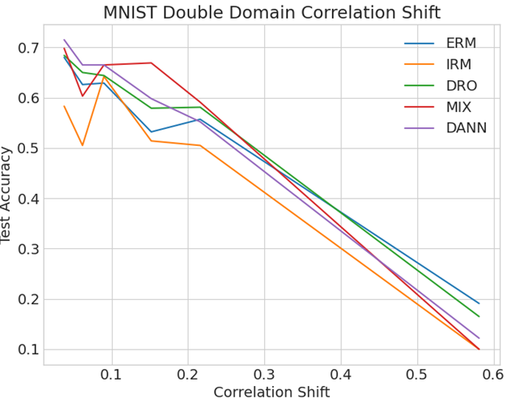
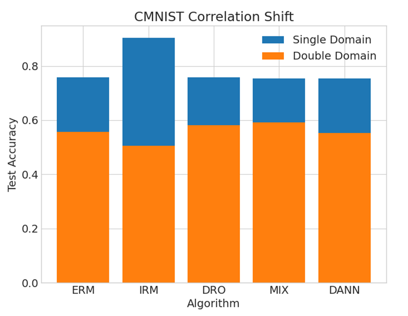

# Benchmarking Distribution Shifts for Domain

# Generalization

Kinshuk Sharma
Northeastern University
Boston, MA
sharma.kin@northeastern.edu

## Abstract

Machine Learning algorithms assume that training and testing distributions are sim-
ilar. However, the need for developing methods that can achieve out-of-distribution
(OOD) generalization is felt when tackling real world problems. Domain Gener-
alization aims to achieve OOD generalization by training on a number of source
domains so as to perform well on an unseen test domain. In this paper we numer-
ically quantify different kinds of distribution shifts. And evaluate a number of
popular domain generalization algorithms on these shifts to observe how different
distribution shifts affect them.

## 1 Introduction

Domain Generalization is a crucial problem in machine learning, as it aims to develop models that can
generalize well to unseen data from new domains. This is particularly important in scenarios where
data is collected from a variety of sources, and the distribution of the data may vary significantly
between domains. For example, a model trained on images of buildings in urban environments may
not perform well when applied to images of buildings in rural environments, due to differences in
lighting, background, and other factors. In order to develop models that can generalize well to a wide
range of domains, it is necessary to develop methods that can adapt to these distribution shifts.

There are several different types of distribution shifts that can occur between domains, and each type
presents its own challenges for model generalization. For instance, a distribution shift may involve
changes in the underlying distribution of the data, such as changes in the underlying data generating
process or the distribution of data points across different classes. Alternatively, a distribution shift
may involve changes in the way the data is represented, such as changes in the features used to
represent the data or the noise present in the data. In order to effectively evaluate the performance
of different methods for Domain Generalization, it is necessary to examine benchmarks that can
simulate these different types of distribution shifts.

However, evaluating the effectiveness of different approaches to Domain Generalization is challenging,
as it is difficult to simulate distribution shifts in a controlled manner. In addition, the performance of
a model can vary greatly depending on the specific type of distribution shift that it is faced with. As a
result, it is difficult to compare the performance of different methods and determine which ones are
most effective. To address these challenges, we examine a framework for benchmarking different
kinds of distribution shifts in the context of Domain Generalization. This approach allows for the
systematic evaluation of a wide range of methods, and provides insights into the relative performance
of different approaches under different types of distribution shift.

## 2 Quantifying Shifts

2.1 Datasets

2.1.1 Colored MNIST

Colored MNIST (Arjovsky et al. [2019]) is a variation of the MNIST handwritten digit classification
dataset. The Colored MNIST dataset is a more challenging version of the original MNIST dataset,
as it includes colored images instead of grayscale images. This additional complexity makes the
Colored MNIST dataset more difficult to classify, and therefore provides a useful benchmark for
testing the performance of machine learning algorithms.

The Domains are defined as d∈{ 0. 1 , 0. 2 , 0. 9 }, each domain contains a disjoint set of digits colored
either red or green. The label is a noisy function of the digit and color, such that color bears correlation
d with the label and the digit bears correlation 0.75 with the label. This dataset contains 70,
examples of dimension (2, 28, 28) and 10 classes.

### 2.1.2 PACS

The PACS dataset (Li et al. [2017]) is a collection of images from a variety of domains, including
photo, art, cartoon, and sketch domains. The dataset is commonly used for evaluating the performance
of machine learning algorithms in the context of domain adaptation and domain generalization. The
PACS dataset is challenging because it includes images from diverse domains, which can make it
difficult for models to generalize to unseen data from new domains. This dataset comprises four
domains d∈{art,cartoons,photos,sketches}. This dataset contains 9,991 examples of dimension
(3, 224, 224) and 7 classes.

2.2 Algorithms

The following algorithms were tested:

2.2.1 Empirical Risk Minimization (ERM)

ERM (Vapnik [1999]) (Empirical Risk Minimization) is a general framework for machine learning,
which aims to find a model that minimizes the empirical risk over a training dataset. The empirical
risk is defined as the expected loss of the model on the training data, and is typically estimated by
averaging the loss over all of the training examples. ERM is a widely used approach to machine
learning, and has been applied to a variety of tasks, including classification, regression, and clustering.

$$\theta_{\text{erm}} = \arg\min_{\theta} \mathbb{E}_{(x,y)\sim p(x,y)} \left[ \ell(x,y,\theta) \right]$$

In this equation, $\theta_{\text{erm}}$ represents the parameters of the model that are found by minimizing the empirical risk, $(x,y)$ represent a pair of input and output, $p(x,y)$ represents the joint distribution of input and output, and $\ell$ represents the loss function used to measure the performance of the model. The equation states that the goal of ERM is to find the parameters $\theta_{\text{erm}}$ that minimize the expected loss over the joint distribution of input and output.

2.2.2 Invariant Risk Minimization (IRM)

Invariant Risk Minimization (IRM) (Arjovsky et al. [2019]) is a framework for machine learning
that aims to find a model that is invariant to certain nuisance factors in the data, while still being
able to accurately predict the target variable. In other words, IRM seeks to learn a model that is
robust to variations in the nuisance factors, such as variations in the data distribution or changes in
the features used to represent the data. IRM is a relatively new approach to machine learning, and has
been applied to a variety of tasks, including classification and reinforcement learning.

$$\min_{\phi: X \rightarrow Y}  \sum_{e \in \epsilon_{tr}} R^e (\phi) + \lambda \cdot || \nabla_{w|w = 1.0} R^e (w \cdot \phi) ||^2$$

In this equation, $\phi$ represents the function that maps inputs $X$ to outputs $Y$, $\epsilon_{tr}$ represents the set of training examples, $R^e(\phi)$ represents the empirical risk on the $e$-th training example, and $\lambda$ is a hyperparameter that controls the trade-off between minimizing the empirical risk and maximizing the invariance of the function $\phi$. The term $\nabla_{w|w = 1.0} R^e (w \cdot \phi)$ represents the gradient of the empirical risk with respect to the scalar $w$, evaluated at $w = 1.0$. The equation states that the goal of IRM is to find the function $\phi$ that minimizes the sum of the empirical risk over the training set and the invariance of the function, as measured by the squared norm of the gradient of the empirical risk.

2.2.3 Group Distributionally Robust Optimization

Group Distributionally Robust Optimization (Group DRO) (Sagawa et al. [2019]) is a variant of
Distributionally Robust Optimization (DRO), which is a framework for optimization under uncertainty.
Group DRO is a generalization of DRO that allows for the modeling of uncertainty over multiple
groups of parameters, rather than just a single group. Group Distributionally Robust Optimization
performs ERM while increasing the importance of domains with larger errors.

$$\theta_{DRO} := \arg_{\theta \in \Theta} \{ R(\theta) := \max_{g\in G} \mathbb{E}_{(x,y) \sim P_g} [\ell(\theta;(x,y))] \} $$

In this equation, $\theta$ represents the parameters of the model, $\Theta$ represents the set of possible parameters, $G$ represents the set of groups of parameters, $P_g$ represents the distribution over the parameters in group $g$, and $\ell$ represents the loss function used to measure the performance of the model. The equation states that the goal of Group DRO is to find the parameters $\theta$ that minimize the maximum expected loss over the set of groups $G$. 

2.2.4 Inter-domain Mixup

Inter-domain Mixup (Yan et al. [2020]) is a method for regularizing deep neural networks in the
context of domain adaptation and domain generalization. The method is based on Mixup, which is
a data augmentation technique that linearly interpolates between pairs of training examples. Inter-
domain Mixup extends Mixup to interpolate between examples from different domains, in order to
encourage the model to learn features that are invariant to the domain of the input. Inter-domain
Mixup performs ERM on linear interpolations of examples from random pairs of domains and their
labels.

̃$$ \tilde{x} = \lambda x_i + (1 - \lambda) x_j $$

$$ \tilde{y} = \lambda y_i + (1 - \lambda) y_j $$

In this equation, $x_i$ and $x_j$ represent the inputs of two training examples, $y_i$ and $y_j$ represent the outputs of two training examples, $\lambda$ is a mixing coefficient, and $\tilde{x}$ and $\tilde{y}$ represent the interpolated input and output, respectively. The equation states that Mixup linearly interpolates between pairs of training examples in order to create new, augmented examples.

2.2.5 Domain Adversarial Neural Networks

Domain Adversarial Neural Networks (DANN) (Ganin et al. [2016]) is a method for learning deep
neural networks that are invariant to variations in the domain of the input data. The method is based
on adversarial training, where a domain classifier is trained to predict the domain of the input, while
the main neural network is trained to confuse the domain classifier. This forces the main neural
network to learn features that are invariant to the domain of the input, and improves its performance
on tasks that require generalization across different domains.

2.3 Diversity Shift and Correlation Shift

In a Domain Generalization setting different datasets exhibit different kinds of distribution shifts. For
example, datasets that consist of multiple domains like PACS and VLCS have a diversity in data.
On the other hand something like Colored MNIST uses spurious correlations to construct domains.
Distribution shifts produced by the former are termed as diversity shifts and ones by the latter as
correlation shift (Ye et al. [2021]).

Intuitively the shifts can be seen as follows, correlation shifts are the shifts caused by spurious
correlations. And diversity shift are the shifts caused by diversity of data is embodied by novel
features not shared by the environments.

These are then calculated by the methods mentioned in Ye et al. [2021].

Given two sets of features S and T, the proposed quantification formula for diversity and correlation
shift is given as follows,

 $$   D_{div}(p, q) := \frac{1}{2}\int_S |p(z) - q(z)| dz, $$

$$    D_{cor}(p, q) := \frac{1}{2}\int_T \sqrt{p(z).q(z)} \sum_{y\in Y}|p(y|z) - q(y|z)|dz. $$
## 3 Experiments

3.1 Shifts in Datasets

We tested for correlation shifts on the Colored MNIST dataset in two cases. In the first case, we used
one training domain and one testing domain, and in the second case, we used two domains for both
training and testing. The results showed that the more far apart the domains were, the higher the shift
was. However, using a set of two domains did allow for more versatility in setting the shift. Overall,
we found that the Colored MNIST dataset had almost zero diversity shift. These results support our
hypothesis that the degree of correlation shift is influenced by the distance between the training and
testing domains, and that using multiple domains can improve the versatility of the shift. Although, I

would like to note that we were able to introduce diversity shift in Colored MNIST by introducing a
third color channel of varying intensity, but the tests are conducted on domains without any diversity
shift.

We tested for diversity shift on the PACS dataset, where the domains P,A,C,S were represented by
numbers from 0 to 4 respectively. In this case, we tested for shifts in sets of ones and twos, but found
that the ability to vary the diversity shift was much better in the case of two training and two testing
domains. Therefore, we conducted our testing on that case. We found that the correlation shifts on
PACS were almost zero. These results support our hypothesis that using multiple domains for both
training and testing can improve the versatility of the diversity shift, and that the PACS dataset has
low correlation shift.

This leaves us with a very good testing environments because Correlation shift conditions can now be
modelled by Colored MNIST and diversity shift by PACS and both remain unaffected by the other
kind of shift. We had also tested on Camelyon17 from WILDS (Koh et al. [2021]), and that was also
a good source of diversity shift. However, that dataset is very large and to save on computation time
we went ahead with PACS. CIFAR10 (Krizhevsky et al. [2009]) was also tested and it was found that
it has very low levels of both correlation and diversity shift.

3.2 Performance

All algorithms mentioned previously are evaluated on selected cases of correlation shift and diversity
shift. ERM performs well in both cases, this is in line with results from Gulrajani and Lopez-Paz
[2020]. For the correlation shift cases ERM performs best when the shift is very high, other methods
also fall back to ERM in this case. For moderately high shifts Mixup, DANN and DRO perform
well, with IRM also performing well for specific cases. For the diversity shift case, IRM and DANN
methods performed poorly while ERM, GroupDRO, and Mixup methods performed better, ERM
performed better than the other two methods at lower values of shifts and slightly worse when the
shift increases.

## 4 Discussion

ERM performing well is not surprising as recent work has shown it to be quite robust, and the results
will appear to favour ERM because the test cases are average performance over multiple domains.
It is often the case that the other algorithms perform better than ERM for particular domains and
worse in others leaving the ERM performing better on average. It is worth mentioning that most cases
in Colored MNIST are in the moderate shift range, and in this range Mixup gave the best results,
followed by DANN and Group DRO. Mixup giving good results in these cases might be a result of
the augmentations diminishing the results of the shift because after mixup the training domains might
look a lot more close then they were.

Does this mean that IRM failed? Not quite. To more closely examine what was going on with IRM,
and why it was under-performing considering that it was a method developed to deal with spurious
correlations, performance was compared in the case of same moderate correlation shift but one case
has single testing and training domains while the other has two for both. It was observed that for
the single domain case IRM manages to perform the best out of all the methods and the worse for
the double domain case. This means that IRM is having trouble learning invariants when exposed
to multiple domains with varying shifts. Even in the double domain cases, most of the time IRM
manages to outperform other methods on one of the test domains and performs worse on the other
bringing the average performance down. Both cases have the same correlation shift but the methods
act differently, this does suggest that the correlation shift metric might be missing something and
there might be a need for something that can also quantify the variation between domains and not
just the overall shift.

For the diversity shift case ERM, Group DRO and Mixup perform well. The trends are not strong
enough to form any correlation but all perform reasonably well. IRM and DANN on the other hand
fail, what is interesting is that in Gulrajani and Lopez-Paz [2020] where there is only one test domain
and three domains to train on, both of these methods also perform reasonably well. Now, the reason
for failure in this case might be that these methods need more domains to train on to perform well, but
in either case the performance should not have so much disparity especially for IRM which should
just fall back on ERM in cases like this.

## References

M. Arjovsky, L. Bottou, I. Gulrajani, and D. Lopez-Paz. Invariant risk minimization.arXiv preprint
arXiv:1907.02893, 2019.

Y. Ganin, E. Ustinova, H. Ajakan, P. Germain, H. Larochelle, F. Laviolette, M. Marchand, and
V. Lempitsky. Domain-adversarial training of neural networks.The journal of machine learning
research, 17(1):2096–2030, 2016.

I. Gulrajani and D. Lopez-Paz. In search of lost domain generalization. arXiv preprint
arXiv:2007.01434, 2020.

P. W. Koh, S. Sagawa, H. Marklund, S. M. Xie, M. Zhang, A. Balsubramani, W. Hu, M. Yasunaga,
R. L. Phillips, I. Gao, et al. Wilds: A benchmark of in-the-wild distribution shifts. InInternational
Conference on Machine Learning, pages 5637–5664. PMLR, 2021.

A. Krizhevsky, G. Hinton, et al. Learning multiple layers of features from tiny images. 2009.

D. Li, Y. Yang, Y.-Z. Song, and T. M. Hospedales. Deeper, broader and artier domain generalization.
InProceedings of the IEEE international conference on computer vision, pages 5542–5550, 2017.

S. Sagawa, P. W. Koh, T. B. Hashimoto, and P. Liang. Distributionally robust neural networks for
group shifts: On the importance of regularization for worst-case generalization.arXiv preprint
arXiv:1911.08731, 2019.

V. N. Vapnik. An overview of statistical learning theory.IEEE transactions on neural networks, 10
(5):988–999, 1999.

S. Yan, H. Song, N. Li, L. Zou, and L. Ren. Improve unsupervised domain adaptation with mixup
training.arXiv preprint arXiv:2001.00677, 2020.

N. Ye, K. Li, L. Hong, H. Bai, Y. Chen, F. Zhou, and Z. Li. Ood-bench: Benchmarking and understand-
ing out-of-distribution generalization datasets and algorithms.arXiv preprint arXiv:2106.03721,
2021.
